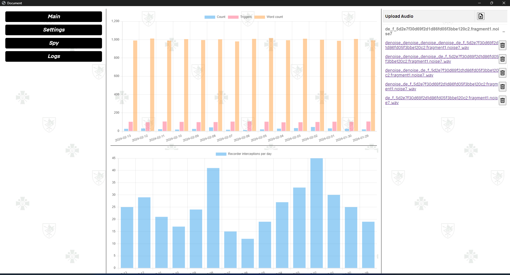
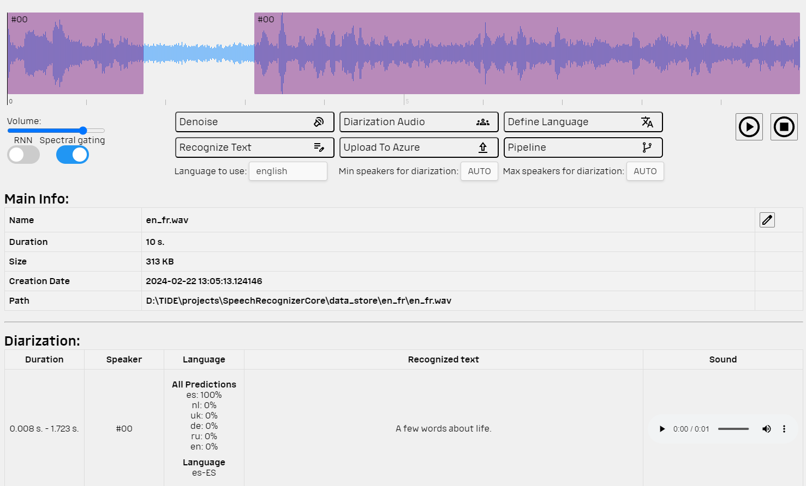
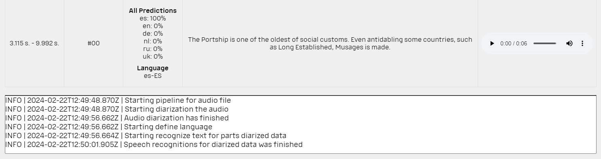
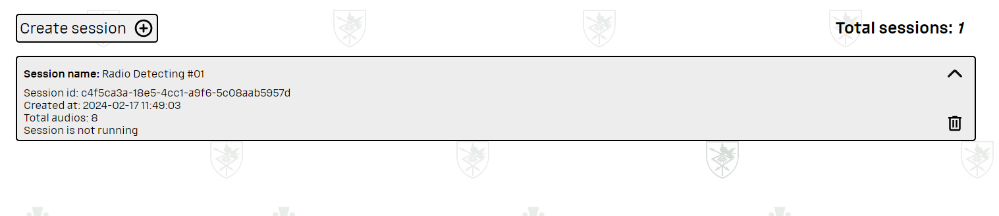
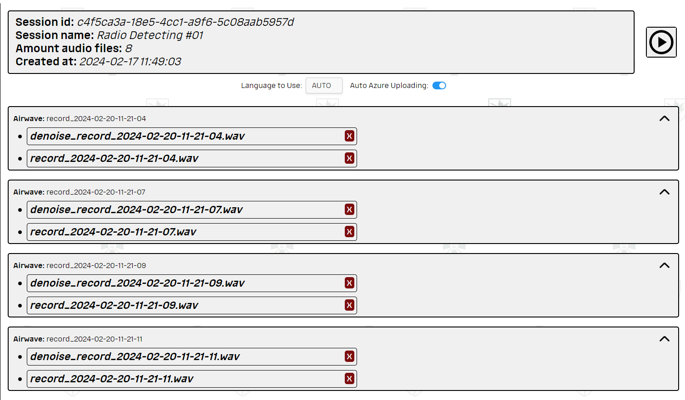
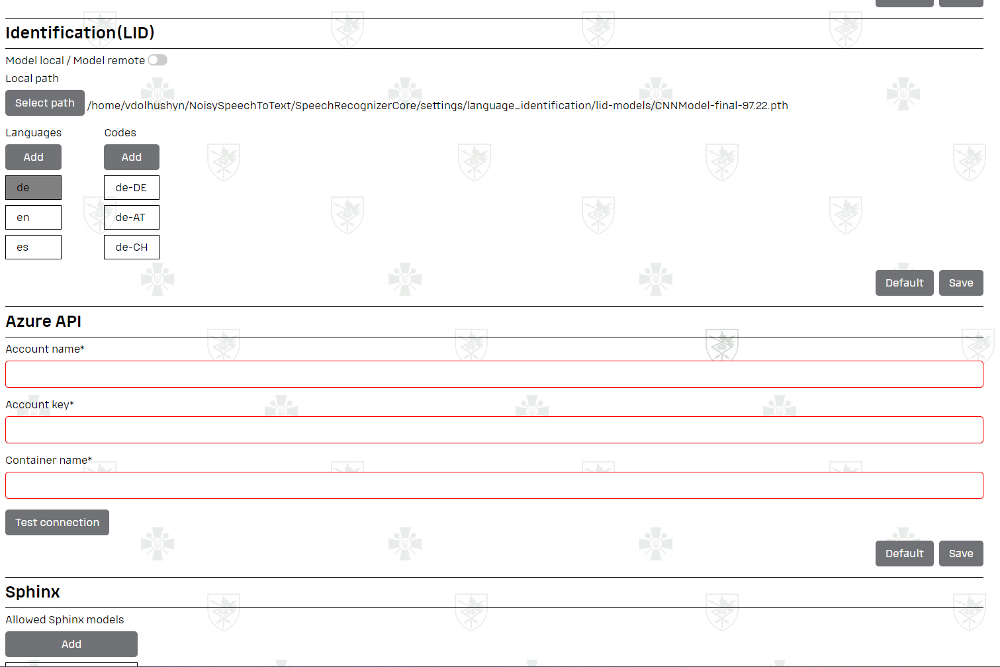

## Installation And Running

### Requirements

- Python 3.10
- Linux / Windows OS

--- 

#### For install dependencies use [Poetry CLI install](https://python-poetry.org/docs/cli/#install)

```bash
poetry install
```

---

### To use *Spy* mode:

For Linux:

```bash
sudo apt update
sudo apt install ffmpeg
```

For Windows:

```ps
winget install ffmpeg
```

or

```ps
choco install ffmpeg
```

### Run Application

```bash
poetry run python main.py
``` 

---

### Using modules separately

To use modules in `main`, create a file named `__init__.py`,
where all necessary functions for working with this module are imported.

To use modules separately, it is necessary to create a file `__main__.py`,
which is executed independently.

---

## Functionality

There are 4 main pages of application

- [Main Page](#main-page)
- [File Page](#file-page)
- [Spy](#spy)
- [Session](#session-)
- [Settings](#settings)

---

## Main Page

In current page analytics and file uploader are presented. <br>



Some graphics and charts can show statistic of recorded audio per day (month, week etc.). <br>

File uploader gives you easy way to upload whatever file you want. It will be converted to `.wav` format by default.

Under the file uploader a several links to File Page. Each file that was uploaded has its own page where user can
communicate with it.

## File Page

Each step of pipeline can be manually used by operator.




On picture above you can see five buttons.

- `Denoise`. Clicking on it will be created new denoised file and uploaded to current page.
  Using[ pre-trained model RNN](https://github.com/vbelz/Speech-enhancement)
  and [Spectral Gating algorithm](https://github.com/timsainb/noisereduce/tree/master) we separate speaker speech from
  audio stream.
- `Diarization Audion`. To work only with the usefully parts of audio (that contains speech not silent) we define
  intervals where speaker talks. To recognize specker we use [Pyannote Audio](https://github.com/pyannote/pyannote-audio). After audio will be cut by these intervals. We can open each file at its own page and
  do it recursively. Now model trained for the **Ukrainian, Russian, Dutch, Deutsch, English and Spanish** languages
- `Define Language`. Using Self-trained model will be recognized language. It's necessary because not every speech
  recognizer can transcribe the text without pre-defined language.
- `Reconginze Text`. To recognize text you can use [Sphinx](https://github.com/sphinx-doc/sphinx)
  or [Whisper](https://github.com/openai/whisper). The pros of using sphinx - it provides its own solution to teach the
  models. See [CMUsphinx](https://cmusphinx.github.io/wiki/tutorialam/). In
  the [STANAG](https://apps.dtic.mil/sti/tr/pdf/ADA510391.pdf) you can see how NATO's RSO used Sphinx to process speech
  in realistic battlefield environment.
- `Upload To Azure`. Optionally giving ability to upload data to Azure Blob Storage Cloud. Provide your credentials in [settings.json](./settings/settings.json) file (or type in Settings)


## Spy

The main idea of *Spy* mode - do every step of pipeline if Auto Mode.



Create the session to store all received audio from stream in it.

## Session 

Before listen make sure you have allowed using the microphone and have chosen it in [Settings page](#settings).



Spy will detect the audio, cut it and do pipeline.

## Settings

Provide your own settings, sphinx models etc.



---

## Application Architecture

Application is base on the following file structure:

```text
.
├── azure_blob_storage
├── converter_to_wav
├── denoise
├── diarization
├── language_identification
├── source_recognizer
├── speech_recognizer
├── logs
├── web
├── exceptions
├── settings
├── sources
├── data_store
├── config
├── poetry.lock
├── pyproject.toml
├── README.md
├── pipeline.py
└── main.py
```

There you can see the packages necessary for audio pipeline. Each pacakge has its own `README.md`.

- [Azure Blob Storage](./azure_blob_storage/README.md)
- [Converter To Wav](./converter_to_wav/README.md)
- [Denoise](./denoise/README.md)
- [Diarization](./diarization/README.md)
- [Language Identification](./language_identification/README.md)
- [Source Recognizer](./source_recognizer/README.md)
- [Speech Recognizer](./speech_recognizer/README.md)

The data storage also has its own `README.md` file where described way to store the data

- [Data Store](./data_store/README.md)

## Web Architecture

```text
.
├── assets
├── js
├── css
├── expose
│   ├── index.py
│   ├── pipeline
│   └── spy
├── logs.html
├── main.html
├── session.html
├── settings.html
├── file.html
├── spy.html
└── vendor
    ├── accordion-js
    ├── chartjs
    ├── hystmodal
    ├── three-dots
    ├── toastify
    └── wavesurfer
```

The file structure of UI is typically for FE applications. There are `.html` templates with `.js`, `.css` files.
There is also `vendor` folder with third-party libraries for UI.

User interface was created using the [Eel library](https://github.com/python-eel/Eel). It's Open Source Electronic-like
offline HTML/JS GUI apps, with full access to Python capabilities and libraries.

The `expose` folder contains `.py` files necessary for UI. JavaScript calls Python functions described in `expose`
directory. The functionality is similar to Controllers in MVC.

### P.S.
We also provide `csv_parser` package. We make it to transform all our transcribed data in `.csv` format  