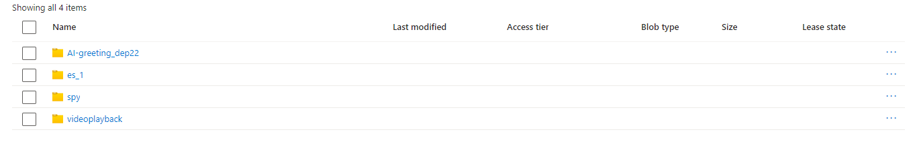
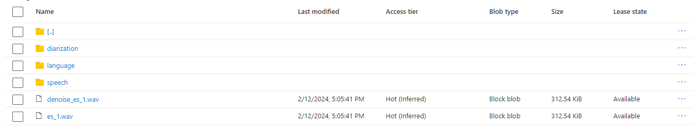
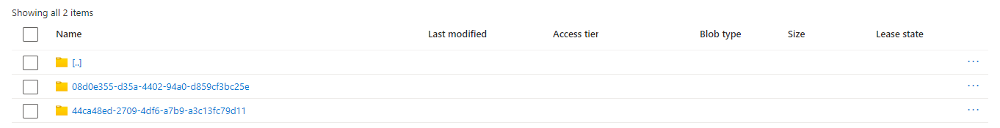

## Azure Blob Storage package

### What Is it?

The package is used for uploading recorded data (statistics, spectrograms, images, audios etc.) to the Azure Cloud. <br>

Storing data in Azure Cloud can help other applications and solutions to communicate with `Speech Recognizer Core`. <br>

All data standardized by folders and can be accessible from anywhere.

### File structure
```text
.
├── azure_config.py
├── azure_worker.py
├── __init__.py
├── __main__.py
└── README.md
```

### Azure Cloud 
To have access to your remove Azure Blob Storage client provide your [Azure Blob Storage](https://azure.microsoft.com/en-us/products/storage/blobs) credentials in settings.json
`./settings/settings.json`:
```json
{
  "azure_api": {
    "azure_account_name": "",
    "azure_account_key": "",
    "azure_container_name": ""
  }
}
```

### Azure Storage

Clicking the uploading button you synchronize your local `data_store` with remote.

Here you can see general structure:



Structure of file `es_1`



And of spy mode:



As you can see architecture the same as of [Data Store](../data_store/README.md)
