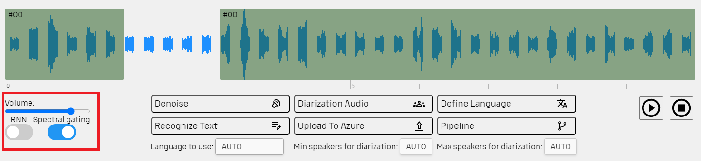
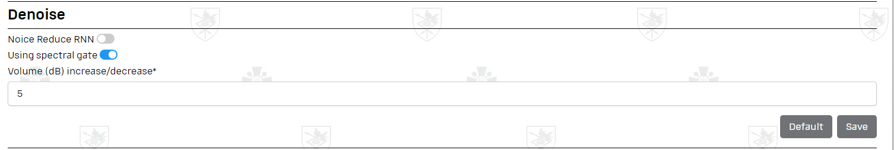

## Denoise

To denoise the audio we use two ways:

- `RNN (Recurrent Neural Network)` that 'predict' audio without
  noise. [Speech-enhancement](https://github.com/vbelz/Speech-enhancement) - is the open source RNN solution we use. 
  We generate 3-dimensional matrix and using [Libroso](https://github.com/librosa/librosa) generate spectrogram of audio
  file. 'Feed' the RNN and optimize the output audio.
- `Spectral Gating Algorithm`. The [noisereduce](https://github.com/timsainb/noisereduce/tree/master) library uses this
  method to denoise the audio. Its open source.

Denoise can be proceeded by two difference way or using the both (mix).

In the [File Page](../README.md#file-page) you can define the way to denoise during manually wprking with file

In the [Settings page](../README.md#settings) you can define the way to denoise during *Spy* pipeline

