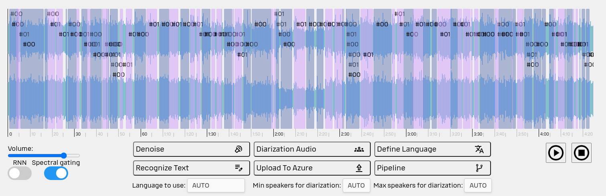
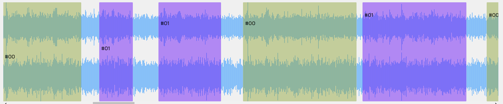
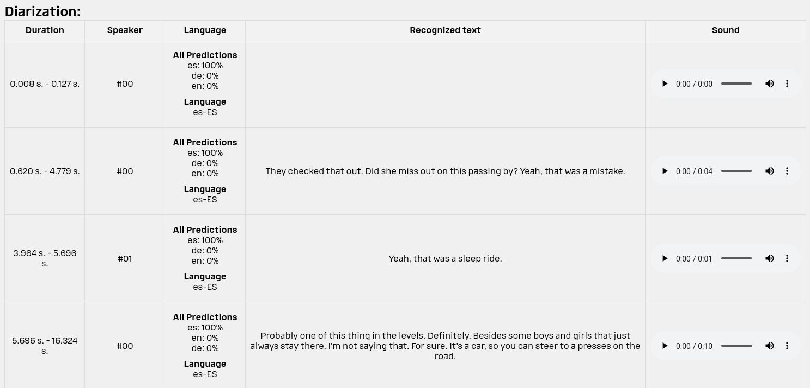
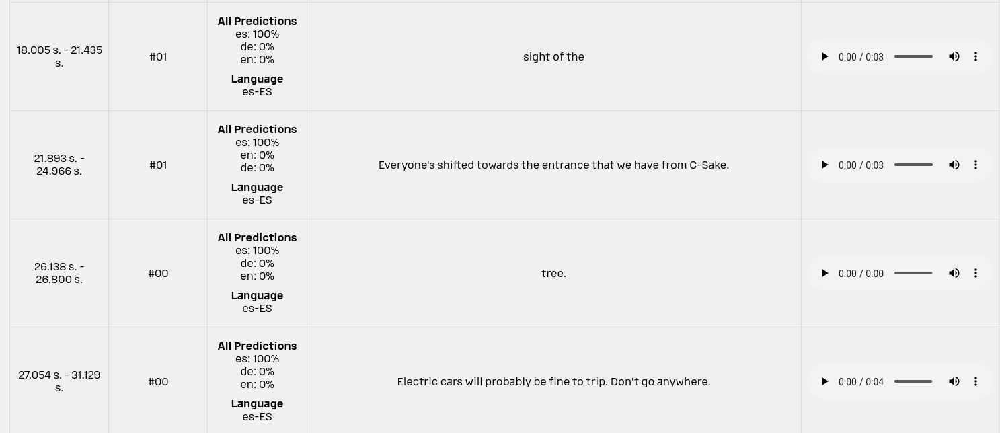

## Diarization (Speaker recognizer)

Diarization is one of the main step of our pipeline. To work with parts that contains speech (not silence). Diarization
allows us to recognize the speaker that talks and intervals of file.  

To do it we use Open Source solution [Pynnote](https://github.com/pyannote/pyannote-audio). It provides tools to create
own diarization-models and easy-understanding guide. Also, data set is presented.

Below you can see how diarization model recognized speakers. We mark it on audio file for better understanding

You can zoom:

There is the table in the bottom of page with the necessary data:

