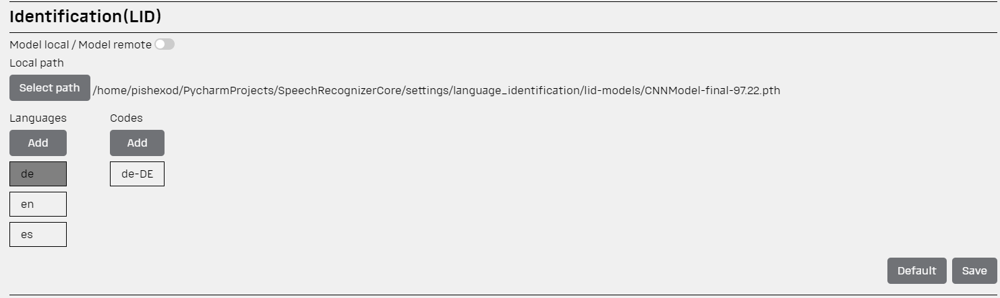

## Language Identification (LID)

After [Denoise](../denoise/README.md) and [Diarization](../diarization/README.md) steps we can define the language.
Yes, [Whisper](https://github.com/openai/whisper) can do it automatically, but not the every model you are going to use,
can define language in auto mode. For example [Sphinx](https://github.com/sphinx-doc/sphinx) transcribe the audio only
with pre-defined language.

To identificate the language we use self-trained model that was taught on the
data-set [Common Voices](https://commonvoice.mozilla.org/en/datasets) provided by Firefox.

Data set was normalized to remove the audio records duration of bigger than ~60 seconds.

On conclusion, we have gotten data set for the `6` languages with about `200 000` records

Available languages:

- Deutch
- Dutch
- English
- Spanish
- Ukrainian
- russian

In the frameworks of TIDE NATO, we have shared our models
to [Azure Blob Storage](https://satidehackathon.blob.core.windows.net/itworkshop/).
Models have `.pth` extencion.

## How does it work

To identificate the language we 'pull' the spectrogram of file and 'put' it to the image. You can find it
in `./data_store/language/*.png` file. Next we 'feed' our model and
using [Torch Vision](https://pytorch.org/vision/stable/index.html) to generate tensor of audio's spectrogram.

Our model finds similarity between the images to define the language.

Example of generated audio spectrogram to define the language:


Getting result of prediction in `.json` file with the following data structure: 
```json
{
  "language_probabilities": {
    "de": 0.0,
    "en": 100.0,
    "es": 0.0
  },
  "language": "en",
  "language_tags": [
    "en-US"
  ]
}
```

### Don't forget

Also don't forget to choose the path of your language model in [Settings Page](../README.md#settings)


