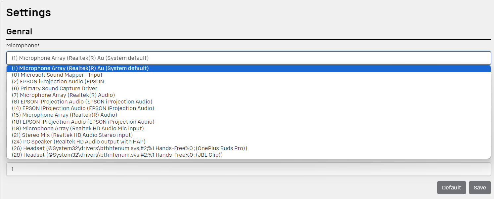

## Source Recognizer

The package necessary to select the microphone you are going to use in `Spy` mode.

Select the input device in [Settings Page](../README.md#settings) to listen for receiving data:
 
