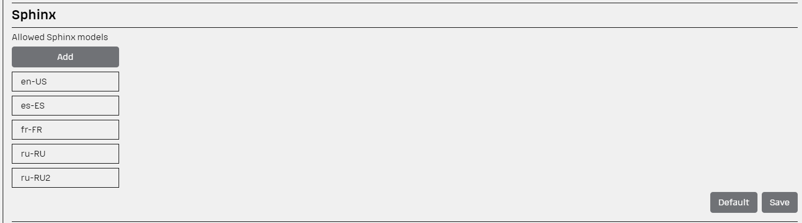
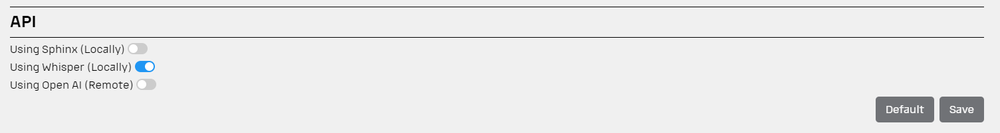

## Speech Recognizer

Speech recognition is the one of the last step or audio's pipeline.

To transcribe the audio we provide a few tools:

- [Sphinx Model](https://github.com/sphinx-doc/sphinx)
- [Whisper Model](https://github.com/openai/whisper)

### Sphinx

It possible to provide your own sphinx-trained model. Sphinx provide their own method
described [here](https://github.com/ericholscher/sphinx-training) how to teach speech recognition model.

You can easily manage your sphinx models in [Settings Page](../README.md#settings):

Right-click on the model to remove it.

In the frameworks of TIDE HACKATHON we share our sphinx model
on [Azure Blob Storage](https://portal.azure.com/#view/Microsoft_Azure_Storage/BlobPropertiesBladeV2/storageAccountId/%2Fsubscriptions%2Ff42e51ac-049b-42f9-bc17-579e38ffabbf%2FresourceGroups%2Frg_tide-hackathon_infra%2Fproviders%2FMicrosoft.Storage%2FstorageAccounts%2Fsatidehackathon/path/itworkshop%2Fsphinx-models.zip/isDeleted~/false/versionId/2024-02-22T10%3A59%3A47.9298851Z/tabToload~/0)

More Sphinx Models can be
founded [here](https://sourceforge.net/projects/cmusphinx/files/Acoustic%20and%20Language%20Models/)

By default all Sphinx models are stored in  
`'./venv/lib/python3.*/site-packages/speech_recognition/pocketsphinx-data/'` folder for Linux OS

or

`'venv/Lib/site-packages/speech_recognition/pocketsphinx-data'` for Windows

## Whisper

Whisper OpenAI Speech Recognition Model is OpenAI's advanced natural
language processing technology, specifically tailored for recognizing and transcribing speech

## To choose

You can easily choose which speech recognition model you would like to use in [Settings Page](../README.md#settings)

